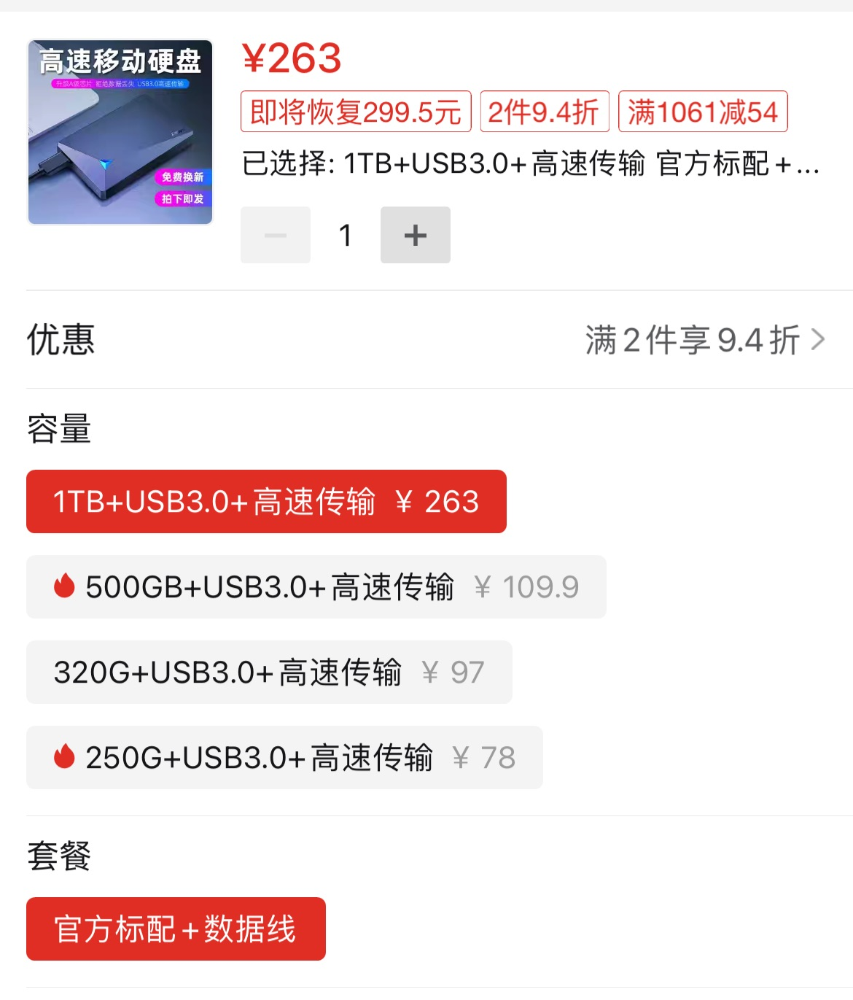
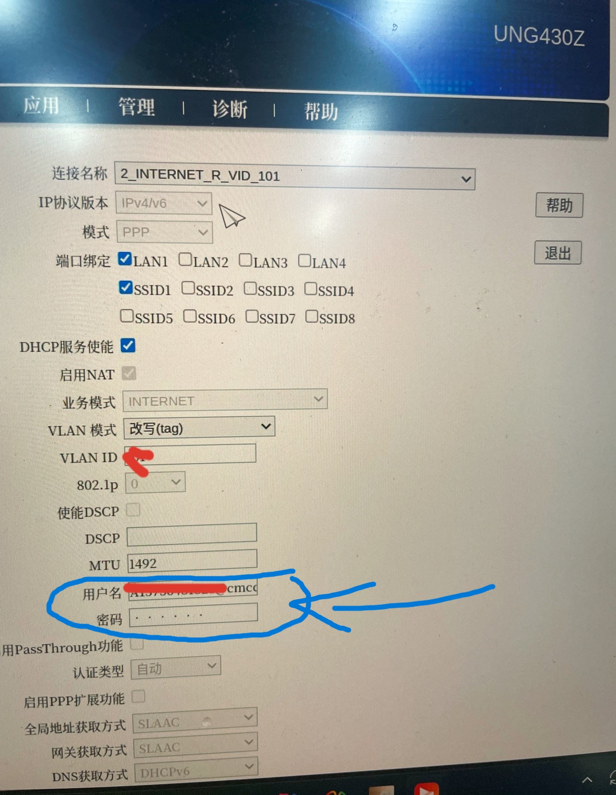
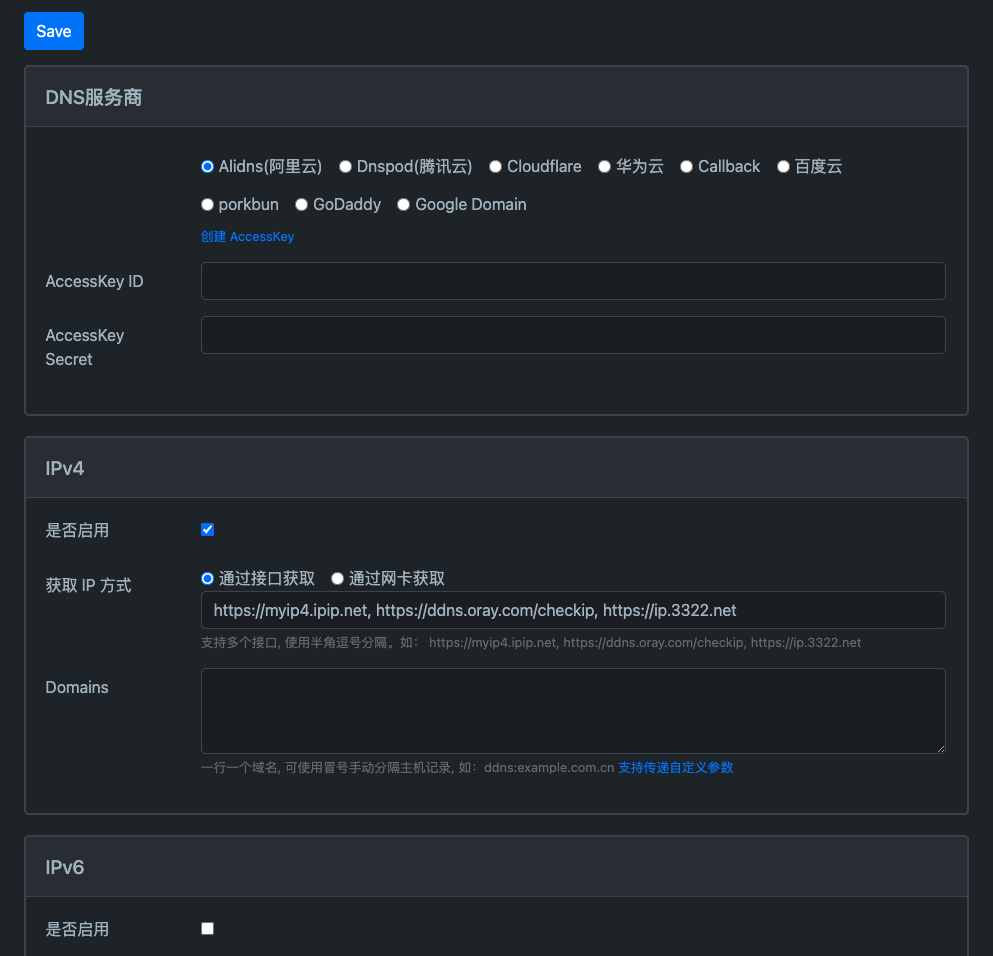
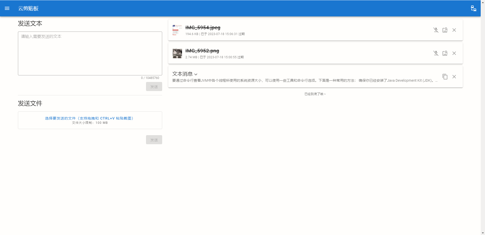
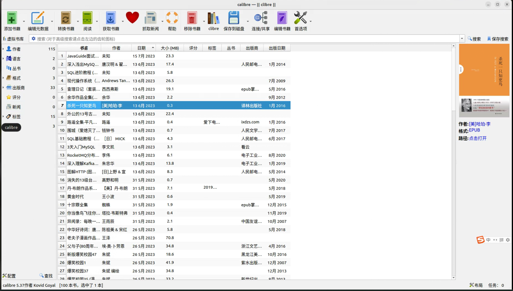
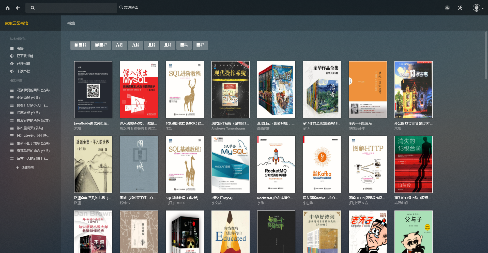
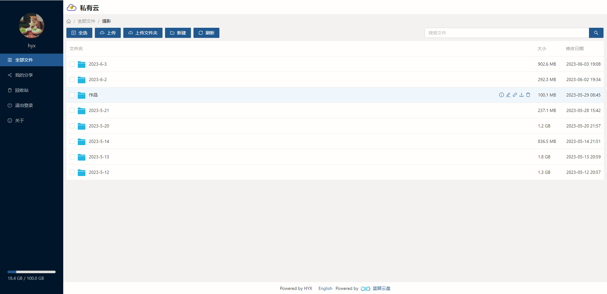
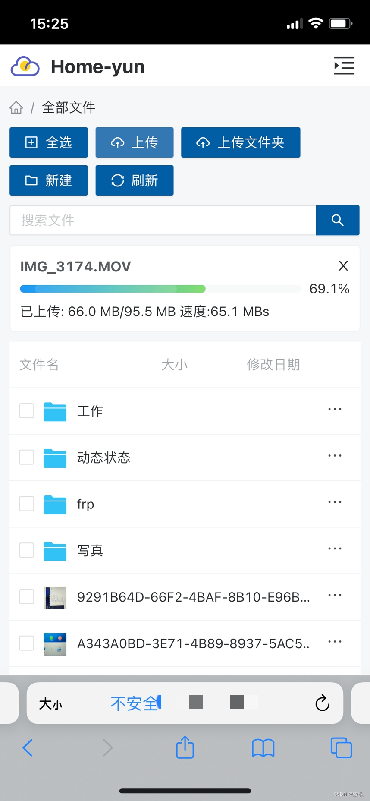
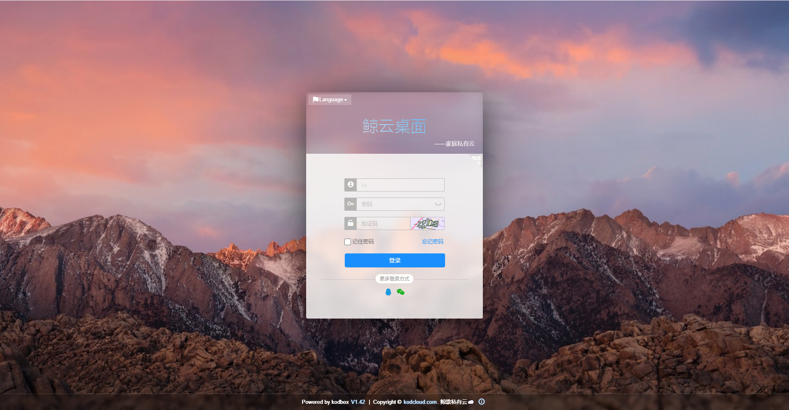
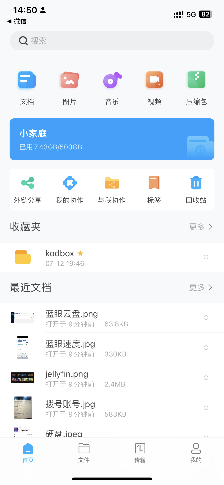

# 万字长文手把手教你搭建家庭私有云

随着互联网的普及，现在的云产品越来越多，像生活中常用的网盘、视频软件、音乐软件、电子书、云笔记等等越来越离不开我们的生活，但是想必大家也受够了“非会员”的各种限制，什么限速呀、广告呀、功能收费呀等等，因此一方面为了我的数据我做主和免去各种限制，何不搭建一个家庭的私有云呢？本文章将根据本人搭建私有云的经验，提供一些解决方案和开源服务推荐。

## 一、设备

### 1、服务器选择

设备的话不用过度关注性能，毕竟私有云也没打算公开使用，像闲置的笔记本、迷你主机、闲置的机箱这些都可以作为服务器。不差钱的当然可以选择NAS，😶像我这种经济有限的可以选择在二手平台上淘一个二手的迷你主机再搭配一个外接硬盘作为服务器，如下图：




### 2、操作系统安装

操作系统的话个人建议装Linux，像Centos或者Ubuntu都可以，Ubuntu体验更好一点，平常除了当服务器也可以插一个显示器当一个小电脑用。装系统其实特别简单，准备一个12G以上的U盘就可以搞定，这边提供一些网络教程：

[Ubuntu系统（桌面版）装机教程](https://zhuanlan.zhihu.com/p/626494709)：https://zhuanlan.zhihu.com/p/626494709

[如何安装Ubuntu操作系统](https://www.qingsword.com/qing/1258.html)：https://www.qingsword.com/qing/1258.html

GPT的回答：

1. 准备工作：
   - 下载Ubuntu操作系统的ISO映像文件。您可以从Ubuntu官方网站（https://cn.ubuntu.com/download/desktop）上获取最新的稳定版本。>
   - 插入空的U盘到计算机上。
2. 创建启动U盘：
   - 打开一个可用的计算机，并下载和安装一个名为Rufus的免费工具。您可以从Rufus官方网站（https://rufus.ie/）上获取它。
   - 运行Rufus工具，并确保在"设备"下拉菜单中选择正确的U盘。
   - 在"启动选择"部分，点击"选择"按钮，并浏览到您之前下载的Ubuntu ISO映像文件。
   - 在"分区方案"部分，选择"MBR"（用于传统BIOS）或"GPT"（用于UEFI）。
   - 在"文件系统"部分，选择"FAT32"。
   - 点击"开始"按钮，Rufus将开始创建启动U盘。请注意，这将擦除U盘上的所有数据，所以在继续之前请确保备份重要文件。
3. 配置计算机：
   - 关闭计算机，然后插入刚刚创建的启动U盘。
   - 打开计算机，并进入计算机的BIOS设置。通常，在开机过程中按下Del键、F2键或F12键可以进入BIOS设置。
   - 在BIOS设置中，找到"启动顺序"或"引导选项"等类似选项，并将U盘设置为首选启动设备。确保将其设置为比硬盘驱动器更高的优先级。
   - 保存并退出BIOS设置。
4. 安装Ubuntu：
   - 计算机重新启动后，它将从U盘启动，并进入Ubuntu安装程序。
   - 在Ubuntu安装程序的欢迎屏幕上，选择您的语言，然后点击"安装Ubuntu"按钮。
   - 在接下来的屏幕上，您可以选择是否连接到Wi-Fi网络并更新安装程序。
   - 在"安装类型"屏幕上，选择"清除磁盘并安装Ubuntu"以进行全新安装，或选择其他选项（例如双重启动）来满足您的需求。然后点击"继续"按钮。
   - 在接下来的屏幕上，选择您的时区和键盘布局，然后继续。
   - 在"您的个人信息"屏幕上，填写必要的信息，例如您的姓名、计算机名称和登录凭据。
   - 安装程序将开始将Ubuntu操作系统安装到您的计算机上。等待安装过程完成。
   - 安装完成后，您将收到一个通知。点击"重新启动"按钮，将计算机从U盘启动到新安装的Ubuntu系统。

完成以上步骤后，您的计算机将安装并运行Ubuntu操作系统。请注意，安装过程可能会因您的计算机硬件和网络速度而有所不同。

**注意！要事先试试自己的主机如何进入BIOS，如何设置U盘启动。**

### 3、服务器配置

安装完操作系统后需要先装几个必备的软件，后面能够为我们安装其他的服务提供帮助。这里仅介绍基于Linux的安装，毕竟我也没在window上搞过；🧐

#### a. SSHD

SSHD是用于提供安全远程访问和管理的SSH服务器守护程序。它是SSH协议的服务器端实现，通过加密和身份验证机制，允许用户在网络上通过安全的连接远程登录到主机并执行命令，说简单点就是允许我们在任何一台联网主机上通过命令行管理我们的服务器。下面有些参考的网络教程和GPT的回答：

[ssh的安装及配置](https://blog.csdn.net/wandugu/article/details/123703586?utm_medium=distribute.pc_relevant.none-task-blog-2~default~baidujs_baidulandingword~default-0-123703586-blog-125843690.235^v38^pc_relevant_sort&spm=1001.2101.3001.4242.1&utm_relevant_index=1)：网址太长这里不贴出来，按住ctrl单击"ssh的安装及配置"可以跳转。

GPT：

要在Linux上安装SSH服务器（SSHD），您可以按照以下步骤进行操作：

1. 打开终端：
   
- 在Linux系统中，打开终端应用程序。您可以在应用程序菜单中找到它，通常位于“系统工具”或“实用工具”下。
  
2. 安装OpenSSH服务器：
   - 在终端中，以root或具有管理员权限的用户身份运行以下命令来安装OpenSSH服务器：
     ```
     sudo apt update
     sudo apt install openssh-server
     ```

3. 配置SSH服务器：
   - 安装完成后，OpenSSH服务器将自动启动并开始监听默认的SSH端口22。
   - 默认情况下，SSH服务器将接受所有来自网络的连接。如果您希望限制访问权限，您可以编辑SSH服务器的配置文件。在大多数Linux发行版中，该文件位于`/etc/ssh/sshd_config`。
   - 使用文本编辑器打开`sshd_config`文件，并根据您的需求进行修改。例如，您可以更改SSH端口、启用密钥验证或限制特定用户的访问等。
   - 修改完成后，保存并关闭`sshd_config`文件。
   - 重新加载SSH服务器配置，以使更改生效。运行以下命令：
     ```
     sudo systemctl reload ssh
     ```

4. 防火墙设置（可选）：
   - 如果您的Linux系统上启用了防火墙（如iptables或ufw），您需要打开SSH端口以允许远程连接。
   - 运行适用于您的防火墙的命令，打开SSH端口。例如，如果您使用的是ufw防火墙，可以运行以下命令：
     ```
     sudo ufw allow ssh
     ```

5. 测试SSH连接：
   - 安装和配置完成后，您可以通过使用SSH客户端从另一台计算机连接到您的Linux系统来测试连接。
   - 在远程计算机上，打开一个SSH客户端（如OpenSSH、PuTTY等）。
   - 在SSH客户端中，输入您的Linux系统的IP地址或主机名，并使用您的Linux系统上的有效用户名和密码进行身份验证。
   - 如果一切正常，您应该能够成功连接到您的Linux系统，并在终端中进行操作。

通过按照以上步骤安装和配置SSH服务器，您就可以在Linux系统上启用SSH服务，并通过SSH客户端进行远程连接。

**注意！所有的安装操作几乎都需要root用户才能完成，因此你需要配置root用户的密码，建议SSHD不要允许root用户直接登录，你可以通过命令`sudo passwd root`来修改root用户的密码。可以参考一下配置**

```conf
#/etc/ssh/sshd_config

Include /etc/ssh/sshd_config.d/*.conf
# SSHD运行的端口号，建议设置成高位端口号
Port 10000
# 是否允许root用户直接登录
PermitRootLogin no
```

#### b. Nginx

Nginx是一个高性能的开源Web服务器和反向代理服务器，可以帮助我们管理web服务，提供https支持和安全管理。下面提供一下安装教程：

[Linux安装Nginx的详细步骤](https://blog.csdn.net/adaizzz/article/details/126669430)：https://blog.csdn.net/adaizzz/article/details/126669430

[ubuntu编译安装nginx](https://blog.csdn.net/qq233325332/article/details/121975064)：https://blog.csdn.net/qq233325332/article/details/121975064

GPT（内容太多，我剪出来）：

- 安装编译工具及其依赖项：

```bash
sudo apt update
sudo apt install build-essential
```

- 下载解压Nginx源码

```bash
mkdir -p /root/software/nginx
cd /root/software/nginx
wget http://nginx.org/download/nginx-1.21.6.tar.gz
tar -xf nginx-1.21.6.tar.gz
cd nginx-1.21.6
```

- 配置编译选项（你可以按需增减）

```bash
./configure --prefix=/usr/local/nginx --with-http_stub_status_module --without-http-cache --with-http_ssl_module --with-http_gzip_static_module --with-ipv6 --with-http_sub_module
make
sudo make install
```

- 验证

```bash
nginx -v
--nginx version: nginx/1.21.6
```

- 启动

```bash
nginx
```

一般来说编译安装后nginx就已经加入了sbin目录下，可以任意地方运行，如果没有找到可以试试执行命令`find /usr -name "nginx"`来查找。

**常用命令：**

```bash
# 重新加载
nginx -s reload
# 退出
nginx -s quit
# 启动
nginx
```

#### c. supervisor

Supervisor是一个用于进程管理的客户端/服务器系统。它提供了一种方便的方式来监控、控制和管理在Linux系统上运行的进程。通过`supervisor`我们可以很方便的管理、启停服务。

[Supervisor使用详解](https://blog.csdn.net/qq_32109917/article/details/120985481?utm_medium=distribute.pc_relevant.none-task-blog-2~default~baidujs_baidulandingword~default-0-120985481-blog-130564751.235^v38^pc_relevant_sort&spm=1001.2101.3001.4242.1&utm_relevant_index=1)：按住ctrl单击可以跳转。

[Linux下supervisor安装和使用](https://blog.csdn.net/qq_43515713/article/details/127304462?spm=1001.2101.3001.6650.6&utm_medium=distribute.pc_relevant.none-task-blog-2%7Edefault%7EBlogCommendFromBaidu%7ERate-6-127304462-blog-120985481.235%5Ev38%5Epc_relevant_sort&depth_1-utm_source=distribute.pc_relevant.none-task-blog-2%7Edefault%7EBlogCommendFromBaidu%7ERate-6-127304462-blog-120985481.235%5Ev38%5Epc_relevant_sort&utm_relevant_index=7)：按住ctrl单击可以跳转。

GPT：

要在Linux上安装Supervisor，您可以按照以下步骤进行操作：

1. 打开终端：
   
- 在Linux系统上，打开终端应用程序。您可以在应用程序菜单中找到它，通常位于"系统工具"或"实用工具"下。
  
2. 安装Supervisor：
   - 在终端中，以具有管理员权限的用户身份运行以下命令来安装Supervisor：
     - 对于基于Debian/Ubuntu的系统，使用apt包管理器：
       ```
       sudo apt update
       sudo apt install supervisor
       ```
     - 对于基于Red Hat/CentOS的系统，使用yum包管理器：
       ```
       sudo yum install epel-release
       sudo yum install supervisor
       ```

3. 配置Supervisor：
   - 安装完成后，Supervisor将自动启动，并创建默认的配置文件和目录。
   - 您可以编辑Supervisor的配置文件以满足您的需求。在大多数Linux发行版中，该文件位于`/etc/supervisor/supervisord.conf`。
   - 使用文本编辑器打开`supervisord.conf`文件，并根据您的需求进行修改。您可以配置Supervisor来管理您的进程、定义启动命令、监视进程状态等。
   - 修改完成后，保存并关闭`supervisord.conf`文件。

4. 启动Supervisor：
   - 运行以下命令启动Supervisor服务：
     ```
     sudo service supervisor start
     ```

5. 验证安装：
   - 运行以下命令检查Supervisor的状态：
     ```
     sudo supervisorctl status
     ```
   - 如果Supervisor已成功启动，您将看到Supervisor的状态信息。

现在，您已成功安装并启动了Supervisor。您可以使用Supervisor管理和监控进程，以确保它们在后台持续运行。请参考Supervisor的文档以了解更多关于配置和使用Supervisor的详细信息。

**常用命令：**

```bash
# 查看状态
supervisorctl status
# 重新载入配置
supervisorctl update
# 停止|重启|启动某个服务
supervisorctl stop|restart|start XXXX
# 停止|重启|启动所有服务
supervisorctl stop|restart|start all
```

#### d. docker

docker是一种开源的容器化平台，用于构建、发布和运行应用程序。它通过利用容器化技术，提供了一种轻量级、可移植和可扩展的方式来封装应用程序及其依赖项，以便在不同的环境中进行部署和运行。很多应用都提供了docker版本，如果不想下非常多的依赖项可以直接使用应用提供的docker进行安装，好的docker镜像几乎可以一键安装启动。

[安装docker](https://yeasy.gitbook.io/docker_practice/install)：https://yeasy.gitbook.io/docker_practice/install

docker相关配置很多，而且不同的应用的配置都不同，要根据应用官网提供的命令教程来进行镜像拉取和配置启动容器。

## 二、网络

说了这么多的配置，其实对于一些熟悉计算机的同学说不定已经都准备好了，想要搭建私有云其实最核心的还是网络，现在的家庭网络都是内网环境，出了这个家就和我们的家庭云说拜拜了，家庭云成了名副其实的“家庭云”，如果申请到了公网ipv4的大佬那当我没说，这边我主要尝试了两种解决方案，一种是内网穿透、另一种是家庭光猫桥接获取公网ipv6，现在自己用的是后面一种方案，家里的千兆宽带不能浪费了😁。

### 1、内网穿透

内网穿透主要的原理就是利用一台公网服务器来转发内网的资源，实现内网穿透，鄙人尝试过zerotier、frp、花生壳，个人还是觉得frp更为简单方便，因此这里就只介绍frp来实现内网穿透。

[frp中文官网](https://gofrp.org/docs/)：https://gofrp.org/docs/

要使用frp来实现内网穿透的话需要有一台公网的服务器，一般的话国内就在阿里云、腾讯云、华为云等其他云提供商上租服务器，当然是要花钱💰滴。不过一般新人有新人福利，比如免费试用、首购优惠等等，轻量级的服务器的话第一年差不多就是￥40-￥300，当然轻量级不仅仅是配置轻量级，网络也是轻量级，自带的带宽就只有1MB，1MB什么概念呢，上传或者下载一个文件就是500KB/S左右，如果想搭私有云盘这网速简直吐血（所以后面我使用的第二种解决方案😁）。说偏了说偏了，下面就介绍如何安装frp。

- 下载：可以去GitHub的release里面下载：https://github.com/fatedier/frp/releases/tag/v0.51.0
- 配置frp分为frps和frpc，即服务端和客户端，服务端在租的公网服务器上运行，客户端在内网服务器上运行，frps的配置是frps.ini，frpc的配置是frpc.ini。这里简单介绍配置文件内容，具体的可以去[官网](https://gofrp.org/docs/reference/)查看:

```ini
#frpc.ini

# 服务器配置，配置地址、端口号以及token
[common]
server_addr = www.yourserver.com
server_port = 7002
token = serverToken

# 下面就是具体要暴露到公网的服务，这是一个vnc的服务
[vnc]
type = tcp
local_ip = 127.0.0.1
local_port = 5901
remote_port = 5901

# 这是一个泰拉瑞亚的服务
[Terraria]
type = tcp
local_ip = 127.0.0.1
local_port = 7777
remote_port = 7777

# 这是一个web服务
[web]
type = http
local_port = 80
custom_domains = www.yourdomain.com
```

```ini
# frps.ini

# 服务器配置
[common]
# 端口号
bind_port = 7002
# 控制台端口号
dashboard_port = 7003
# token
token = serverToekn
# 控制台登录用户名
dashboard_user = admin
# 控制台登录密码
dashboard_pwd = password
vhost_http_port = 7004
vhost_https_port = 7005

authentication_timeout = 30
log_file = /root/software/frp/frps.log

```

启动frp特别简单

```bash
./frpc -c frpc.ini
./frps -c frps.ini
```

**小建议：建议使用supervisor来管理frp，这样在发生某些异常后可以自动重启frp，防止无法访问服务；建议启动两个frp进程，一个是frp-app，专门负责app的内网穿透，还有一个是frp-ssh，只负责sshd的穿透，这样在重启frp时就只需要重启frp-app而不影响ssh，避免无法访问服务器。**

### 2、公网ipv6

没有公网IPV4，没钱买服务器怎么办，那就搞个公网IPV6。现在基本三家运营商都提供了公网ipv6，只是大部分装宽带的师傅都是光猫拨号，路由器DHCP上网，导致这个IP被光猫霸占了。所以要获取这个公网IP思路很简单，就是光猫改成桥接模式，由路由器来拨号上网。这个过程最大的阻碍就是如何获取光猫的超级管理员账号，拿到这个账号我们才能对光猫的网络进行修改，这个密码在刚刚装宽带时都是有初始密码的，但是一个月后运营商会通过光猫的一个网络连接把你的超管密码给改了，就问你坑不坑😒。网上有很多怎么破解这个账号密码的教程，但是很容易让光猫变砖，为什么不直接给宽带师傅发条消息问密码呢？多简单，说辞我都帮你想好了，就说你**买了一个性能很强的路由器，你想把光猫改成桥接，用路由器拨号，好发挥路由器的性能，强硬点，都会给你**，所以这里我就假如你已经搞到了光猫的账号密码了，这里我先把**注意事项写在前面**，这样遇到问题的时候才不慌：

**注意事项：**

- 在开始对光猫进行改桥接前先准备一根网线，一端插在光猫后面的网口，一边插在电脑上，电脑连接路由器的wifi（如果光猫有wifi也可以连接光猫的wifi），防止改桥接后就访问不了光猫后台了，但是如果光猫取消了DHCP服务后然后你又重启了光猫，那即使连着网线也访问不了光猫了，下面会介绍怎么办。

- 除了问宽带装修师傅光猫超级管理的账号密码之外还要问设备注册的账号密码，防止误删连接或者其他异常操作导致无法上网，如果无法上网用牙签去戳光猫的reset按钮直到所有灯亮起恢复出厂设置，然后重新设备注册。
- 因为管理光猫需要一台电脑访问光猫的后台管理界面，最怕的是什么呢？**就是网络没有，然后还不能访问光猫的后台了**（**出现这种情况的最大原因就是取消了光猫的DHCP服务**），此时不要慌，这种情况下可能是由于你和光猫不在一个网段了所以无法访问，假如你的光猫的管理界面的IP地址是192.168.1.1（光猫背面写的有），那么你就可以修改为192.168.1.2，你需要修改你连接光猫的电脑的网段，子网掩码填255.255.255.0，网关填光猫地址

[如何设置ip地址和网关](https://jingyan.baidu.com/article/a3a3f8118be64dcca2eb8ac7.html)：https://jingyan.baidu.com/article/a3a3f8118be64dcca2eb8ac7.html

[如何更改电脑ip地址和网关](http://www.ujiaoshou.com/upanjc/diannao/10217.html)：http://www.ujiaoshou.com/upanjc/diannao/10217.html

[Ubuntu22.04 设置IP地址](https://blog.csdn.net/tsliuch/article/details/130738890)：https://blog.csdn.net/tsliuch/article/details/130738890

- 要提前知道自己的拨号账号和密码，如下图蓝色圈着的部分，光猫的连接名称为INTERNET字样下的配置里面有拨号的账号，密码无法查看（F12大法可以），不过密码没有修改过的都是手机号后六位，不对打人工客服，他会给你发一个重置密码的短信。



- **光猫改桥接涉及到网络连接的删除和重建（或者修改），不要啥都不看就直接删了，特别要记住VLAN ID的值和拨号的用户名密码。**

注意事项差不多就说完了，下面附上我之前写的一个教程和其他网络教程：

[获取移动公网ipv6（光猫桥接）](https://blog.csdn.net/qq_45060540/article/details/130305363?spm=1001.2014.3001.5502)：https://blog.csdn.net/qq_45060540/article/details/130305363?spm=1001.2014.3001.5502

[光猫设置的万字经验总结](https://www.zhihu.com/question/378163166/answer/2904836635)：https://www.zhihu.com/question/378163166/answer/2904836635

[光猫桥接设置指南](https://www.zhihu.com/tardis/zm/art/358075010?source_id=1003)：https://www.zhihu.com/tardis/zm/art/358075010?source_id=1003

当你光猫改了桥接、路由器也拨号上网成功后你就可以进入[IPV6测试](https://test.ipv6s.com/)网站进行测试了，得分十分，就说明你已经有公网IPV6了


这时候可能还会来一个拦路虎，因为我们使用的是ipv6，然而有的网络不支持ipv6，比如我们公式的宽带，如果不支持那我不是白搭建了吗（虽然手机流量都支持ipv6），这里说说我的解决方案。要实现ipv4环境访问ipv6，要么去阿里申请一个隧道服务，要么哼哼~，kx上网，有些代理服务器支持双栈协议，只需要开着代理就能直接访问家庭网络了，不过这里我不会贴怎么个kx上网，大家自行加油哟~

### 3、其他免费解决方案

免费的内网穿透提供商我用过的就有花生壳和zerotier，花生壳的话网速要比免费版本的zerotier好一点，毕竟zerotier的转发服务器在国外，下面附上官网：

[花生壳](https://hsk.oray.com/)：https://hsk.oray.com/

[zerotier](https://www.zerotier.com/download/)：https://www.zerotier.com/download/

## 三、云环境搭建

假如你看到这里了那么恭喜你最艰难的地方你已经走过了🎇，剩下的就是如何搭建我们的云了，下面我会列举些我用到的开源软件，大家可以按需安装。

### 1、DDNS

如果网络你使用的是公网ipv6方案的话你会发现ipv6的地址长这样：`2001:b030:a18d:a00::85:116`，相比我们的ipv4地址`192.168.10.136`可太不好记了，你如果通过ipv6访问网站的话需要写如下的URL地址：

```http
http://[2001:b030:a18d:a00::85:116]:8080/web
```

而且这个公网的ipv6地址还会自动变化，是不是很坑😒，不过我们还是有解决方案滴，那就是DDNS+域名的方式，DDNS可以实现动态的更新你的ipv6地址到域名解析服务，于是以后我们访问网站就只需要记住域名就行了。

```http
http://www.yourdomain.com:8080/web
```

要实现这个功能你需要先申请一个免费（或者便宜的）域名，一般来说像什么.com、.cn啊这些都是最贵的，最便宜的就是那种不常见的如.top这些，域名国内很多云提供商都有卖的，我是买的阿里的，这里贴上购买[链接](https://wanwang.aliyun.com/?spm=5176.1830550.0.0.4dcd5f0fOsfKVB)。一般第一年会免费，后面的话续费也不贵，买了后一定要记得实名认证，实名后才能正常使用，目前国内ipv6的网站（自用）暂时没有强制备案，毕竟你家庭服务器也不能备案。如果后续有要求的话你也可以去[cloudflare](https://www.cloudflare.com/zh-cn/)上注册一个域名，这是国外的提供商，没有强制备案.。

申请到域名后就可以安装ddns服务了，目前我用的是ddns-go，一个开源的ddns，原生支持阿里、cloudflare这些，github上可以找到[下载地址](https://github.com/jeessy2/ddns-go)，上面有详细的文档，我这里就不作冗述了。界面可以参考一下



点击创建AccessKey后一般会跳转到你选中的服务商的AccessKEY的创建界面。

### 2、云剪贴板

如果你使用的是Ubuntu操作系统，在你安装软件时肯定从其他地方拷贝文件或者文字，云剪贴板是一个web端的文件文本传共享工具，界面如下：



[开源地址](https://github.com/TransparentLC/cloud-clipboard)：https://github.com/TransparentLC/cloud-clipboard

### 3、jellyfin

你喜欢看电影吗？喜欢看电视吗？想一个地方下载，多终端观看吗？我知道你想😁，jellyfin为我们提供了解决方案：可以看一下界面：

web：


手机（IOS APP）：


当然还有安卓TV端和安卓手机端，安装jellyfin应该算是很简单的了，apt搞定，下面贴上教程：

[如何在 Ubuntu 22.04 LTS 上安装 Jellyfin Media Server](https://www.yundongfang.com/Yun224601.html)：https://www.yundongfang.com/Yun224601.html

GPT：

Jellyfin是一种开源的媒体服务器软件，可用于管理和播放音频、视频和图片。要在Linux上安装Jellyfin，可以按照以下步骤进行操作。我将提供使用Ubuntu的示例，但在其他Linux发行版上的步骤类似。

1. 添加Jellyfin存储库：首先，需要将Jellyfin存储库添加到系统中。打开终端并执行以下命令：

```bash
wget -O - https://repo.jellyfin.org/jellyfin_team.gpg.key | sudo apt-key add -
echo "deb [arch=$( dpkg --print-architecture )] https://repo.jellyfin.org/$( awk -F'=' '/^ID=/{ print $NF }' /etc/os-release ) $( awk -F'=' '/^VERSION_CODENAME=/{ print $NF }' /etc/os-release ) main" | sudo tee /etc/apt/sources.list.d/jellyfin.list
```

2. 更新软件包列表：执行以下命令以更新系统的软件包列表：

```bash
sudo apt update
```

3. 安装Jellyfin：执行以下命令以安装Jellyfin：

```bash
sudo apt install jellyfin
```

4. 启动Jellyfin服务：安装完成后，Jellyfin服务将自动启动。如果没有自动启动，可以使用以下命令手动启动：

```bash
sudo systemctl start jellyfin
```

5. 配置Jellyfin：在浏览器中访问`http://localhost:8096`（或您服务器的IP地址和端口8096），进入Jellyfin的Web界面。在此界面上，您可以设置媒体库、用户帐户等。

6. 访问Jellyfin：完成配置后，您可以使用Jellyfin客户端或支持Emby的应用程序（Jellyfin是Emby的分支）连接到服务器。

请注意，上述步骤假设您正在使用Ubuntu或基于Ubuntu的发行版。如果您使用其他Linux发行版，请相应地修改添加存储库的步骤。同时，确保您有管理员权限（sudo）来执行这些操作。

当然有个媒体管理器还不够，还需要有资源呀，那我就好人做到底吧，贴几个**网盘资源搜索的地址**（第一个基本就够用了）：

[易搜](https://yiso.fun/info)：https://yiso.fun/info

[猫狸盘搜](https://www.alipansou.com/)：https://www.alipansou.com/

[奇妙搜索](https://www.magicalsearch.top/main)：https://www.magicalsearch.top/main

[土狗搜](https://www.tugousou.com/)：https://www.tugousou.com/

一般用的是阿里云盘，不限速，但是如果你是Ubuntu等Linux操作系统的话想直接下载阿里云盘上的资源可以通过一个aliyun-client来完成，[github地址](https://github.com/tickstep/aliyunpan)：https://github.com/tickstep/aliyunpan

### 4、calibre-web

你爱看书吗？爱看小说吗？😶‍🌫️如果肯定的话那你一定要安装一个calibre和calibre-web，calibre是一个电子书管理器，支持多种电子书格式的阅读、转换等等，但是calibre是一个桌面APP，如下图



为了利用我们的家庭云，我们可以安装一个calibre-web，它是基于web的，可以看看界面



它内嵌了在线阅读器，但是更建议下载一个Kindle，搭配calibre-web使用简直不要太香，配置好calibre-web的邮件和用户的kindle邮箱后可以一键推送书籍到kindle，如果你有kindle阅读器或者手机平板安装了kindle都能阅读推送的书籍。下面贴上教程：

[calibre官网](https://calibre-ebook.com/zh_CN/download_linux)：https://calibre-ebook.com/zh_CN/download_linux

[calibre-web](https://github.com/janeczku/calibre-web)：https://github.com/janeczku/calibre-web

[calibre-web架设指南](https://zhuanlan.zhihu.com/p/203539548)：https://zhuanlan.zhihu.com/p/203539548

GPT：

在Linux上安装calibre非常简单，通常可以通过包管理器或官方安装脚本完成。以下是在常见Linux发行版上安装calibre的方法：

1. 在Ubuntu、Debian或Linux Mint上安装calibre：

在终端中运行以下命令来安装calibre：

```
sudo apt update
sudo apt install calibre
```

2. 在Fedora上安装calibre：

在终端中运行以下命令来安装calibre：

```
sudo dnf install calibre
```

3. 在openSUSE上安装calibre：

在终端中运行以下命令来安装calibre：

```
sudo zypper install calibre
```

4. 使用官方安装脚本安装calibre：

如果您的Linux发行版没有提供最新版本的calibre，或者您希望获取官方的安装脚本，您可以使用以下命令从calibre官方网站安装：

```
wget -nv -O- https://download.calibre-ebook.com/linux-installer.sh | sudo sh /dev/stdin
```

这将下载calibre的安装脚本并执行安装过程。

请注意，安装calibre的命令可能因您使用的Linux发行版和软件包管理器而略有不同。在执行安装命令之前，建议先更新您的软件包列表，确保获取最新的软件包信息。

安装完成后，您可以在应用程序菜单中找到calibre图形用户界面（GUI），或者在终端中输入`calibre`命令来启动它。使用calibre，您可以管理、转换和阅读电子书。

电子书的下载的话我一般用的是[Zlibrary](https://zlibrary-asia.se/)，免费下载，资源特别多，前提是你要有kx上网。

### 5、蓝眼云盘

既然有了家庭云那肯定要安装一个家庭云盘，云盘的选择很多，蓝眼云盘就是其中一个，蓝眼云盘是一个基于go语言开发的开源云盘，支持多用户、文件预览、webdav等，目前好像正在开发共享空间的功能，预计2023年7月发布，可以看一下界面：



相比其他网盘来说蓝眼云盘安装非常简单，功能也较为强大，最重要的是是你自己的网盘，不限速：



[官网地址](https://tank-doc.eyeblue.cn/)：https://tank-doc.eyeblue.cn/

### 6、可道云

当我的家庭云服务多起来后我就想能不能弄一个网关，免得在桌面添加很多快捷方式，抱着这个心态无意间发现了可道云，一个十分优秀的国产云盘，有免费版和企业版，免费版只能创建10个用户，但是对于家庭来说完完全全够了。可道云有着非常丰富的功能和漂亮的前端，具备桌面模式和网盘模式，并且提供了多个客户端。最让我满意的是他的插件功能和轻应用功能，轻应用类似一个网站的快捷方式，但是支持在可道云直接打开，可以自己把家庭云的各个服务打包成轻应用，做到登录一端即可享受全部，我这里只贴几张图，更多的功能自己参考[官网](https://kodcloud.com/)。






[官网安装教程](https://kodcloud.com/download/)：https://kodcloud.com/download/

[使用可道云Kodbox快速在云服务器上搭建云盘](https://zhuanlan.zhihu.com/p/549965363)：https://zhuanlan.zhihu.com/p/549965363

### 7、webos

webos是国内一位大佬开发的云盘，支持多网盘挂载，支持桌面模式，界面做的很好看，还支持动态壁纸。


[官网](https://os.tenfell.cn/)：https://os.tenfell.cn/

[docker安装](https://os.tenfell.cn/doc/#/doc/docker)：https://os.tenfell.cn/doc/#/doc/docker

## 四、开始使用吧

如果你已经看到这里，恭喜你已经搭建好了一个家庭云，可以开始享受自己私有云的便利啦。🎈🎊。特别感谢其他贡献教程和开源软件的大佬，收下我的膝盖。

整理太不容易了~

完结。